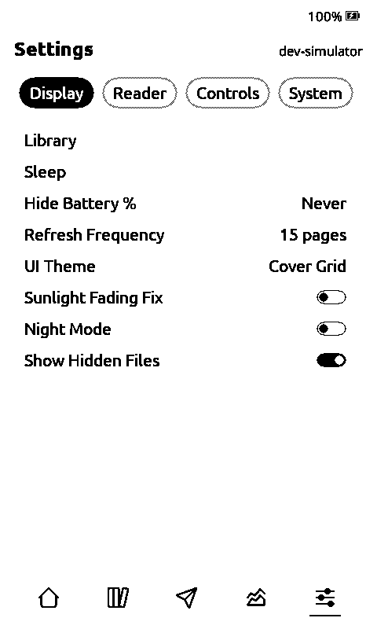

# Matcha X3: reading, CrossPet games, and Anki bridge

This is an **Xteink X3-only** fork of [Matcha Reader](https://github.com/eszter007/matcha-reader), built for reading Japanese. It retains vertical text, dictionary lookup, manga and reading stats, and brings CrossPet's virtual pet and five games to an X3 build. The [companion bridge](https://github.com/ren-jop/matcha-ttu-bridge) handles ッツ import experiments and the computer-side Anki inbox.

The firmware build selects the X3 profile directly, including both supported X3 display controller variants. Other devices are outside this fork's release scope. **Do not flash a development artifact until its X3 build and hardware checks pass.** The current build has not yet been tested on physical X3 hardware.

<p align="center">
  
  
  
  
</p>

### Supported device

- **Xteink X3**, including its supported display controller variants. This fork builds and releases the X3 firmware only.

Full instructions live in the [User Guide](USER_GUIDE.md). This page is the short version.

---

## Features

### X3 home and games

The home screen keeps the book cover and quick menu redraw. **Reading & Play** opens a compact reading dashboard, CrossPet’s virtual pet, and 2048, Sudoku, Minesweeper, Caro (five in a row), and Chess. The pet is fed by forward reading and saved to SD; a built-in pixel sprite appears even without external sprite files. The 2048 best score persists on the SD card. X3 buttons navigate every screen; Japanese labels cover the menu and game screens.

### Vertical Japanese text

Japanese books are detected from their metadata and set vertically: right-to-left columns, kinsoku line breaking, sesame emphasis marks, and furigana beside the kanji. A per-book toggle overrides the detection when you disagree with it.

<p align="center">
  
  
</p>
<p align="center"><em>The same passage, Vertical Text on and off</em></p>

### Dictionary and word lookup

Look up any word on the page, vertically or horizontally. Conjugations resolve to the dictionary form on their own (読んで becomes 読む, 食べませんでした becomes 食べる), and the page is scanned first so you only land on words that actually have an entry.

In vertical text, lookup opens on the page itself: the current word is highlighted where it stands, the side buttons step word by word down the column, Left and Right jump a column, and the definition opens only when you press Look Up. Back returns to the highlighted page, so several words on a page are a few presses apart. The cursor opens mid-page and the scan starts there too, so the half you are looking at is ready first; words it has not reached yet can still be selected, and the highlight moves as soon as the scan arrives. No button labels are drawn over the page — vertical text would be covered by them. Horizontal text opens straight into the definition view as before.

A word broken across a page break still resolves. The lookup reads a few characters past the end of the page, so the half you can see finds the whole word; the highlight stays on the page and covers only the characters that are there.

On a touch device, long-pressing a word on the page opens its definition directly — no setting to turn on, and no cursor to move first. A press that lands between words opens ordinary word selection instead. The panel pages by touch however the reader is set to turn pages, and a tap outside it puts it away.

The definition itself opens as a panel floating over the page you were reading: the word sits above a divider at the top, the entry fills the middle, and the dictionary it came from is named along the bottom. In vertical text and in English books the entry is paged a screenful at a time with a page counter in the top right; horizontal Japanese and manga scroll the entry freely and show your position among the page's words instead.

Vocabulary, names and grammar each come from their own dictionary. If the book itself annotated a reading, the entry opens with "In this book: はやし" and remembers it for the rest of the book. See [Setup](#setup) for the files, and [§6.2](USER_GUIDE.md#62-word-lookup) for how to drive it.

Other languages get the same treatment from their StarDict dictionaries. A word at the start of a sentence keeps its accents and still resolves (`École` finds `école`), and French adds its own rules: `l'eau` looks up `eau`, `journaux` finds `journal`, `heureuse` finds `heureux`, and the regular conjugations resolve to the infinitive (`parlaient` → `parler`, `mangeons` → `manger`, `finissent` → `finir`). The same coverage extends to `-eindre`/`-aindre`/`-oindre` verbs (`éteignit` finds `éteindre`, `craignait` finds `craindre`), `-aître` verbs (`connaissons` finds `connaître`), `-uire` verbs (`conduisit` finds `conduire`), and adverbs formed from an adjective (`lentement` finds `lent`). English and everything else fall back to plurals and verb endings. Irregular verbs that share no stem with their infinitive — and a verb's irregular passé simple, like `connus` or `naquit` — need a `.syn` file in the dictionary folder — see [docs/dictionary.md](docs/dictionary.md).

In French books, a literary verb-subject inversion like `songeai-je` or `pense-t-il` splits into two selectable words (`songeai`/`je`, `pense`/`il`), so both the verb and the pronoun look up on their own. A genuine compound like `rendez-vous` or `grand-mère` still selects as one word.

Hold Confirm for about one second in the definition panel to save the word for Anki. See [Anki companion setup](#anki-companion-setup) for the Wi-Fi transfer and note mapping.

Reader Settings includes **Word Lookup Font Size** (Tiny, Small, Medium or Large) for adjusting dictionary entry text.

<p align="center"></p>

### Page translation

Translates the current page to English with Gemini. Works in any book, not only Japanese ones. Needs Wi-Fi and your own API key.

<p align="center"></p>

### Manga panel reader

Panels are detected at conversion time, along with their text and translations, so lookup and translation work offline and appear instantly. Move panel by panel in reading order, each one scaled to fill the screen.

**Look up any word right in the picture.** On a touch device, hold a word in a speech bubble and its dictionary entry opens, the same as in a book. With buttons, open Word Lookup and an outline appears around a word on the page; the page-turn keys move it word by word and Confirm looks it up. The outline leaves the word readable, and it works on the full page and on zoomed or rotated panels. Books converted before this feature need converting again to get it; see [§6.4](USER_GUIDE.md#64-reading-manga).

**Rotate Panels** (Settings, on by default) turns a panel whose shape does not match the screen, so a wide panel fills the display and you turn the device to read it. Switch it off to keep every panel upright inside the current orientation. **Panels Only** skips the full page overviews. Both are covered in [§6.4](USER_GUIDE.md#64-reading-manga).

Convert with the [browser tool](https://eszter007.github.io/matcha-reader-tools/), or see [Converting manga](#converting-manga).

<p align="center">
  
  
  
  
</p>

### Library

Every book on the card as a cover grid, at any depth. Covers and titles come from the book's own metadata on first
visit, with progress as a badge. Manga sits beside EPUBs. A **Shelves** tab lists folders that contain books.

<p align="center"></p>

CrossPoint's own library screen is still here if you prefer it: an indexed list with title and author search across
thousands of books, sorted by title, author or when they were added. **Settings → Display → Library** gathers the library
settings on one screen, starting with the view switch: **Matcha Covers** (the default) or **CrossPoint List**.

### Cover Grid home, with tabs

The **Cover Grid** theme (the default on touch devices; **Settings → Display → UI Theme** elsewhere) puts a tab bar along
the bottom that stays put as you move between Home, Library, File Transfer, Insights and Settings. The tab you are in is
drawn filled. Nothing opens "on top" any more, so there is no stack to back out of.

On a button-only device the bar is part of one navigation ring rather than a separate thing to reach: **Up/Down** walk a
screen's own tabs, then its rows, then the bottom bar; **Confirm** steps the tabs at the top and past the last one drops
into the bar; **Left/Right** move along the bar, and **Confirm** on the tab you are already in hands the cursor back to
the top. A grey outline marks whatever the cursor is on. Details in
[§3.1.1](USER_GUIDE.md#311-tabs-and-button-navigation-cover-grid-theme).

Covers are built in the background, so the grid appears at once with titles standing in for artwork the device has not
made yet and each cover replaces its own title as it finishes. A button press interrupts the work instead of queueing
behind it.

<p align="center">
  
  
  
  
  
</p>

The SD browser lives inside the Library there, as a third tab beside **Books** and **Shelves**. On the other themes it
stays its own entry on the home menu.

Long press a cover, on the home grid, in the Library or inside a shelf, for **View Stats**, **Mark as Read** /
**Mark as Unread** and **Delete**. On button-only devices, hold **Confirm** on the selected cover. Only the direction that changes something is offered: a finished book has no "Mark as Read". Delete asks
first, and takes the book's reading cache with it.

Swipe down from the top edge for the control centre: brightness and warmth, then round buttons for dark mode, a screen
refresh, orientation, touch controls and the light. Each button names what tapping it does rather than reporting a state.

### Reading stats

Streak, minutes this week, books finished, total time, and a calendar of the days you read. Recorded as you go, every few minutes and again when you close a book, so a flat battery costs you minutes rather than the whole session.

Tabs across the top split the same numbers by language: **All**, then one per language the device has seen. Long press a book in the Library for its own sessions, total time, average session and calendar.

<p align="center">
  
  
</p>

Manga counts the same as EPUBs. Language comes from the book, so set `--language` when you convert manga. Details and the known limits are in [§7](USER_GUIDE.md#7-reading-stats).

### Transparent sleep screen

A wallpaper laid over the page you were reading, so the book shows through instead of being covered. Set **Sleep Screen** to **Transparent** and drop 480x800 BMPs into `.sleep/transparent/` on the card. Images with plenty of white space work best, since anything solid hides the text under it. See [§3.7](USER_GUIDE.md#37-sleep-screen).

<p align="center"></p>

### Also in this fork

- Per-book reader settings: font, size, spacing, margins and orientation are remembered per book
- A built-in CJK fallback font, so the odd kanji in a non-Japanese book still renders
- **Optimize EPUB** on upload: splits single-file Japanese novels into real chapters with a working table of contents, and fits images to the screen as dithered 1-bit BMPs
- More of the book's own CSS respected: headings sized as headings, line spacing, page breaks, boxed asides, and rules written as `.callout p`
- Drop caps: a chapter opening styled with `::first-letter { font-size: … }` gets the enlarged initial the book asked for, with the first few lines wrapping around it
- **Use Book Margins** (Text Settings > Layout, on by default) keeps the indents a book sets for itself, so epigraphs and long quotations stay inset. Turn it off and those blocks sit flush with the body text
- Instant image page turns, since the next image decodes in the background
- Next-book suggestions at the end of EPUB, TXT/Markdown, XTC and manga books
- A file browser that shows everything on the card, with unsupported files greyed out rather than hidden
- Existing Matcha language support; new pet labels fall back to English where untranslated

---

## Setup

> No Python needed. [**Matcha Reader Tools**](https://eszter007.github.io/matcha-reader-tools/) converts dictionaries, fonts and manga in your browser and hands back a zip laid out for the card. Files stay on your machine, except manga OCR, where panels go to Gemini under your own key. ([source](https://github.com/eszter007/matcha-reader-tools))

**1. Flash the firmware.** Download `x3-firmware.bin` from this fork's [X3 v1.6.5 preview release](https://github.com/ren-jop/matcha-x3-crosspet/releases/tag/v1.6.5). If your X3 already runs Matcha, copy the `.bin` to the SD card, open **Settings → SD Card Firmware Update**, and select that file. The updater validates the board before installing it. For an initial USB flash, follow the [upstream X3 flashing instructions](https://github.com/crosspoint-reader/crosspoint-reader). Back up the SD card and keep a copy of your current firmware. The source passes automated CI checks, but the release binary has not been tested on a physical X3. Check the release workflow and asset checksum before flashing.

| Device | Asset |
| --- | --- |
| X3 | `x3-firmware.bin` preview |

Automatic update checks target this fork's X3 releases; GitHub prereleases do not appear in the stable `releases/latest` feed, so install this preview manually from the SD card. The older v1.6.0 asset is superseded by v1.6.5.

**2. Install dictionaries.** Word lookup needs at least a vocabulary dictionary.

Dictionaries are picked by the book's language. Put each one in `dictionaries/<lang>/`, using the language shorthand: `de` for German, `en` for English, `fr` for French, and so on. A book tagged with that language then selects it automatically.

```
dictionaries/
  en/your_dictionary_name/     # English, StarDict files
  fr/your_dictionary_name/     # French, StarDict files
  jp/                          # Japanese, Yomitan files converted for the device
    vocab.idx    vocab.dat    vocab.spx      # vocabulary (required)
    names.idx    names.dat    names.spx      # names (recommended)
    grammar.idx  grammar.dat  grammar.spx    # grammar reference (optional)
```

Japanese is the exception: it always uses the converted files in `dictionaries/jp/`, from [Jitendex](https://github.com/stephenmk/Jitendex), [JMnedict](https://github.com/JMdictProject) or any other Yomitan dictionary. Every other language uses plain StarDict.

The dictionary you pick in Settings becomes the fallback, used when the book has no language or no folder matches it. Reader Settings shows which dictionary a book actually ended up with.

The folder can also be called `.dictionaries/`, which hides it from the file browser. It works exactly the same, including `jp/`.

Convert with the [browser tool](https://eszter007.github.io/matcha-reader-tools/), or the script:

```bash
python3 tools/dict_convert/convert_jmdict.py \
  --input jitendex-yomitan.zip \
  --output-dir /path/to/sd/dictionaries/jp/    # add --name names / --name grammar for the others
```

**3. Install a Japanese font** (optional). The built-in Noto handles Japanese, but a dedicated font looks better. Convert any TTF or OTF with the [browser tool](https://eszter007.github.io/matcha-reader-tools/) and put the result in `.fonts/<Family>/<Family>_<size>.cpfont` — one file per point size, and the size in the filename is the size offered in Text Settings. An SD card Japanese font also fills in rare kanji elsewhere, such as dictionary entries and book titles.

Some folder names pair a font with an entry that is already in the list instead of adding one of their own: `NotoSansJP` / `NotoSerifJP` become the Japanese half of **Noto Sans** / **Noto Serif**, and a `…Extended` name widens the font it is named after. A paired font's sizes are offered on the entry it pairs with, so a book that font carries can be read at any size you install — put `NotoSansJP_20.cpfont` on the card and 20 pt appears under Noto Sans. A book it does not carry (an English one, for a Japanese font) renders at the nearest size the main font ships instead.

**4. Set up translation** (optional). Get a key from [Google AI Studio](https://aistudio.google.com/apikey) and save it as `/system/gemini.key` on the card. A hidden `/.system/` folder works too.

Using all of it: [§6 of the User Guide](USER_GUIDE.md#6-japanese-reading-features).

---

## Anki companion setup

The X3 sends dictionary mines to the [Matcha ↔ ッツ companion repository](https://github.com/ren-jop/matcha-ttu-bridge), which must run on a computer on the same trusted Wi-Fi. This is a separate path from CrossPoint Sync and from the ッツ book import. The device does not talk directly to AnkiMobile or AnkiWeb.

1. Install **Anki Desktop** and its **AnkiConnect** add-on on that computer. Open Anki Desktop with the collection that already contains your Prettify CSS and type-in-answer note type. In Anki, check the exact **deck name**, **note type name**, and **every field name**. The note type owns the card templates and CSS; the companion uses it instead of making a new one.
2. In the companion repository, copy `anki-config.example.json` to `anki-config.local.json`. Set `deck` and `model` to those existing names. Put all fields of that model in `fields`. For each field, set `field_map` to `"expression"`, `"reading"`, `"meaning"`, or `null` (empty). These keys and field names must match Anki exactly. For example:

   ```json
   {
     "deck": "Japanese",
     "model": "My Prettify type-in-answer",
     "fields": ["Expression", "Reading", "Meaning", "Sentence"],
     "field_map": {
       "Expression": "expression", "Reading": "reading",
       "Meaning": "meaning", "Sentence": null
     },
     "sync_ankiweb": true
   }
   ```

   Use your actual model and field names. The X3 sends three values: looked-up word, reading, and dictionary definition. It does not capture a sentence, screenshot, audio, or a review result. A model that requires those needs its own fallback template or a different mining path.
3. Find the computer's **private LAN IP address** on the Wi-Fi shared with the X3. Generate a random token (24 characters minimum), keep it private, and start the companion from its repository directory. Replace `192.168.1.23` with that IP:

   ```sh
   cp anki-config.example.json anki-config.local.json
   python3 -c 'import secrets; print(secrets.token_urlsafe(32))'
   export MATCHA_ANKI_TOKEN='PASTE_THE_GENERATED_TOKEN_HERE'
   python3 anki_bridge.py --config anki-config.local.json --host 192.168.1.23
   ```

   Leave this process running. The companion listens on port **8766** at that LAN address. AnkiConnect listens only on the computer's loopback address, port **8765**. Allow local Wi-Fi access to 8766 in the computer firewall; do not forward it to the internet.
4. Put a file named `/anki-wifi.json` at the **root** of the X3 SD card, with the same IP and token:

   ```json
   {"url":"http://192.168.1.23:8766/v1/mines","token":"PASTE_THE_GENERATED_TOKEN_HERE"}
   ```

5. On the X3, open an EPUB word definition and **hold Confirm for about one second**. “Mine saved” means the JSON was written to `/AnkiOutbox` on the SD card; it does not yet mean Anki has added a note. When Wi-Fi is connected and you are outside the reader, the X3 tries one saved mine about every 15 seconds. A failed request leaves the file for a later retry. On HTTP acceptance, the X3 removes that outbox file; the companion first keeps its own durable SQLite queue and tries AnkiConnect about every 15 seconds.
6. With Anki Desktop open, confirm the note appears in the configured deck under the **existing model**. If `sync_ankiweb` is `true`, the companion requests Anki Desktop's AnkiWeb sync after adding it. Then open **AnkiMobile and sync there** to receive the card and its existing template. If Anki Desktop was closed, opening it later lets the companion process its saved queue. The companion marks a pre-existing duplicate as `conflict` instead of overwriting it.

To inspect the companion's queue, run `curl -H "Authorization: Bearer $MATCHA_ANKI_TOKEN" http://192.168.1.23:8766/v1/status` on the computer, using its actual IP. A mine still in `/AnkiOutbox` means the X3 has not received HTTP 202; check both devices' Wi-Fi, the LAN IP, running process, token, and firewall. A `queued` companion note means the Wi-Fi handoff succeeded but Anki Desktop or AnkiConnect is unavailable. A `conflict` means the configured model or duplicate rule needs attention. The token and `anki-config.local.json` are private; never commit them.

Yomitan has its **own** deck, note type, and field mapping in its Anki settings. Point it at the same existing Prettify type and desired deck, then mine a test card. The X3 companion and Yomitan do not share a live mining queue. CrossPet's game progress is also separate from Anki scheduling.

---

## Converting manga

The [browser tool](https://eszter007.github.io/matcha-reader-tools/) needs no local setup. As a script:

```bash
pip install ultralytics huggingface_hub Pillow
export GEMINI_API_KEY=$(cat /path/to/gemini.key)

python3 tools/manga_convert/convert_manga.py \
  --input /path/to/manga.cbz \
  --output-dir /path/to/sd/manga/MangaTitle/ \
  --language ja \
  --x4
```

Set `--language` on every book. It splits your reading time by language, and it tells the OCR pass which language to expect. Most manga carries no language of its own. The tag is read at conversion time, so a book converted without it counts as unknown until you convert it again.

`--input` takes an image folder, `.cbz`, `.zip`, `.epub` or PDF. The flags worth knowing:

| Flag | Effect |
| --- | --- |
| `--x4` / `--x3` | Scale to the device screen. Smaller files, faster page turns, nothing lost. |
| `--mono` | 1-bit dithered BMP. Good for line art, less so for heavy screentone. |
| `--no-ocr` | Panel boxes only, no Gemini calls, no text or translations. |
| `--ltr` | Read panels left-to-right, for western comics and strips. Default is manga order. |
| `--trim-margins` | Crop the blank paper border and page number off scanned pages. |
| `--webtoon` | Vertical-scroll manhwa or webcomic. Re-cuts the strip into screen-shaped pages. |
| `--yonkoma` | 4-koma strips: read each column top to bottom, then the column to its left. |
| `--max-pages N` | Convert the first N pages as a cheap test. |
| `--title` / `--author` | Override metadata. |
| `--language` | Book language tag. See above. |

Panels are found with a YOLO model trained on Manga109 ([leoxs22/manga-panel-detector-yolo26n](https://huggingface.co/leoxs22/manga-panel-detector-yolo26n)), falling back to a white-gutter heuristic without `ultralytics`. Gemini then reads and translates each panel.

Western comics work too. Pass `--ltr` so panels within a row are walked left-to-right. The panel detector was trained on manga but handles strip layouts well; page turn direction is a device setting (Reverse page turn), not a conversion one.

OCR follows `--language`, so it works on any of them. The prompt names the language it should expect, which is what stops the model hallucinating Japanese out of a German speech bubble, and a book already in English gets transcription without a pointless English-to-English translation. Set the tag even if you don't care about reading stats.

Yonkoma (4-koma) needs `--yonkoma`. A 4-koma page is columns of four panels, read down one column and then down the next, where ordinary manga reads across the page. Without the flag the two strips are interleaved: panel 1, the top panel of the *other* strip, panel 2, and so on. The flag swaps the axes of the ordering rule — a tier becomes a column — so a title page whose left half is one full-height illustration beside a strip of four still comes out right, the illustration being a column of its own. Columns run right to left, or left to right with `--ltr`.

Manhwa and other vertical-scroll webcomics need `--webtoon`. A webtoon is one continuous strip, and distributors ship it pre-sliced into fixed-height tiles whose cuts land wherever the slicer's counter reached — often through a face. This reassembles the strip and re-cuts it at the artwork's own gutters into pages shaped to your screen, so no page opens or closes mid-panel. Panels are then the art blocks between gutters, read top to bottom, and the manga panel detector is skipped: it looks for bordered rectangles in a grid and there are none. A 48-tile chapter came out as 42 pages filling 90% of the screen on average.

Add `--trim-margins` for anything scanned from print. It crops the paper border away before panels are detected, which both fills the screen and measurably improves detection: a Moomin page that came back as 9 panels untrimmed, with one whole strip undivided, split into all 11 once the margin was gone.

The output is a folder of images, panel crops and three small index files. Drop it anywhere on the card, the Library finds any folder containing `panels.idx`.

---

## Building from source

```bash
git clone --recursive https://github.com/ren-jop/matcha-x3-crosspet.git
cd matcha-x3-crosspet
git submodule update --init --recursive   # if you cloned without --recursive
pio run              # build
pio run -t upload    # flash
```

Same PlatformIO setup as upstream. Development notes are in [CLAUDE.md](CLAUDE.md), the on-card cache formats in [docs/file-formats.md](docs/file-formats.md).

### Running without a device

The [simulator](https://github.com/eszter007/crosspoint-simulator-ios) builds Matcha from these same sources and renders the e-ink panel for you. It runs two ways:

- **Desktop** (macOS or Linux/WSL) through PlatformIO, in an SDL2 window.
- **iPhone**, as an app built with CMake and Xcode, with the panel taking real touch input. macOS only — there is no way to build an iOS app from Linux or Windows.

It is not limited to one board. `-DSIMULATOR_DEVICE=` selects the target, defaulting to `x4pro`, with `x4`, `x3`, `x4classic`, `sticky` and `papermono` matching the PlatformIO envs, and `-DSIMULATOR_DISPLAY=uc8179|uc8279` overriding the panel controller. That makes it the practical way to check a change on hardware you do not own — the touch and Home-key boards in particular.

From the simulator checkout, point it at this repository. The path must be absolute — a relative one resolves against `ios/` rather than the simulator's root and fails with "No firmware at ...":

```bash
cmake -S ios -B build-matcha -DCROSSPOINT_FIRMWARE_ROOT="$HOME/Projects/matcha-reader"
cmake --build build-matcha
```

## Compatibility with upstream

This fork tracks upstream CrossPoint and merges new releases. Nearly everything is additive: new libraries (`lib/Dict/`, `lib/MangaPanel/`), new activities (word lookup, translation, manga reader) and the vertical text engine. Existing files see only auto-detection and menu wiring, so merges stay cheap.

## Credits

Built on [CrossPoint](https://github.com/crosspoint-reader/crosspoint-reader), open-source e-reader firmware, community-built and fully hackable.

Dictionary data from [JMdict](https://www.edrdg.org/jmdict/j_jmdict.html) and [Jitendex](https://github.com/stephenmk/Jitendex), under their respective licences. Icons by [Tabler Icons](https://tabler.io/icons) (MIT). Sleep and boot screen logo by [ふにゃ猫 / funyaneko](https://iconbu.com/).
